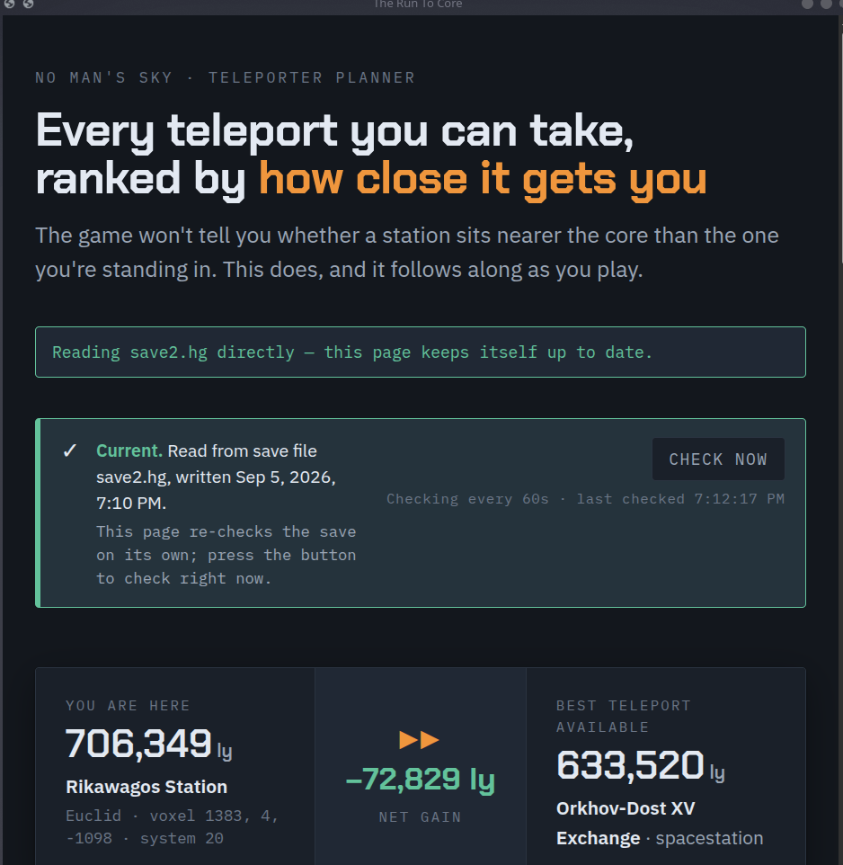
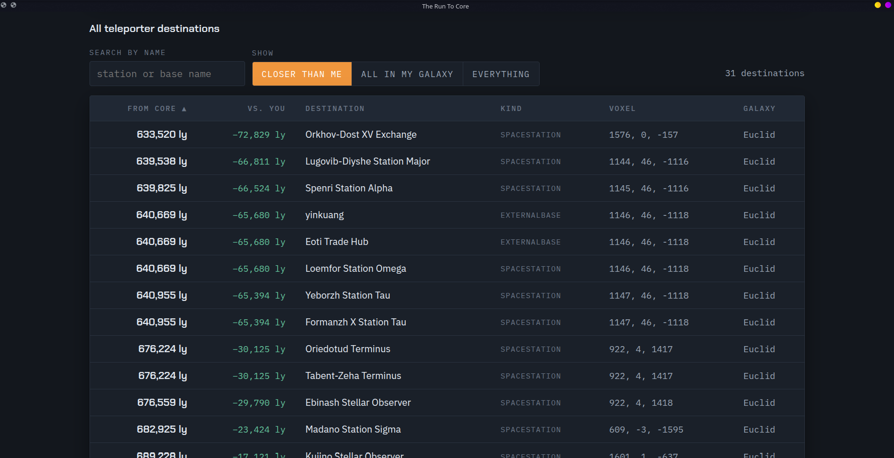

# The Run To Core

A No Man's Sky teleporter planner. It reads your save and tells you, for every
teleporter destination you have banked, whether it is **closer to the galactic
core than where you are standing right now**.

The game does not show this. When you open a space station teleporter you get a
list of names with no indication of which way any of them takes you. If you are
running for the core, that matters: a jump can quietly put you further out than
you have already been, and you will not find out until you arrive.



Every destination ranked, with the ones that move you inward marked in green:



## What it tells you

- How far you are from the core, in light years
- The best teleport available to you, and how much it gains or loses
- Every destination ranked, with the ones that move you inward marked
- A chart of your whole network against your current position
- Destinations stranded in galaxies you have left, greyed out, because the
  teleporter will not offer them

## Download and run

**[Get the latest release](../../releases/latest)**, unzip it, and run it.
Nothing to install -- these are single files with Python built in.

| System | File |
| --- | --- |
| Windows | `run-to-core-windows.zip` |
| Steam Deck and Linux | `run-to-core-linux.zip` |
| Mac (Apple silicon) | `run-to-core-macos-arm64.zip` |
| Mac (Intel) | `run-to-core-macos-intel.zip` |

A small console window stays open while the tool runs. That window *is* the
program -- close it when you are done and the tool stops.

### The unknown-developer warning

These builds are not code-signed, because a signing certificate costs more per
year than a free tool warrants. Your system will say so:

- **Windows:** SmartScreen shows "Windows protected your PC". Click **More
  info**, then **Run anyway**.
- **macOS:** right-click the file and choose **Open**, then **Open** again.
  Double-clicking alone will be refused the first time.

If you would rather not run an unsigned binary -- a reasonable position -- run it
from source instead. It is a few hundred lines of readable Python and the
instructions are below.

### Steam Deck

Switch to **Desktop Mode**, download the Linux zip, unpack it, then right-click
`run-to-core` and choose **Properties -> Permissions -> Is executable**, and run
it. SteamOS already has a browser for the page to open in.

To reach it from Gaming Mode, add `run-to-core` to Steam as a non-Steam game
while you are in Desktop Mode.

## Running from source

Python 3.8 or newer. Nothing else -- no pip install, no dependencies. The LZ4
decompression the save format needs is included in this repository.

```
python3 core_run.py
```

That is the whole thing. It finds your save, opens a page in your browser, and
keeps it up to date while you play.

On Windows, `Run To Core (Windows).bat` does the same thing with a double-click,
and tells you where to get Python if it is missing. `Run To Core (Mac).command`
and `run-to-core.sh` are the equivalents for macOS and Linux.

| Option | What it does |
| --- | --- |
| `--app` | Open as a plain window with no tabs or address bar |
| `--save PATH` | Read a specific save file or folder instead of searching |
| `--list` | List every save found on this machine, then exit |
| `--interval N` | Seconds between checks for a newer save (default 120) |
| `--port N` | Serve on a specific port (default 8787) |
| `--no-browser` | Do not open a browser window |

## How current the numbers are

The game writes your save when it saves -- when you dock, exit your ship, land,
or hit an autosave point. This reads that file, so the page follows a few seconds
behind those moments. It cannot track you continuously as you fly, because
nothing has been written to disk yet for it to read.

In practice this is exactly what you want: **when you dock at a new station, the
page has your new position by the time you have walked to the teleporter.**

The page re-checks on a timer and there is a **Check for a new save** button for
when you do not want to wait for it.

## Window mode

```
python3 core_run.py --app
```

opens the page as a plain window with no tabs and no address bar, using a
Chromium-family browser if one is installed -- your default browser is preferred,
so the window inherits the profile and theme you already use. Without one it
falls back to an ordinary tab. This adds no dependencies: it is the browser you
already have, without the browser furniture.

Launching a second time does not start a second copy. It notices the one already
running and opens that window instead.

## Finding your save

Detection is automatic and covers Steam on Windows, macOS, Linux and Steam Deck,
including games installed on secondary drives and SD cards. If it cannot find
yours, pass it directly:

```
python3 core_run.py --save "/path/to/save.hg"
```

Saves live in a folder named `st_<your steam id>` (or `DefaultUser` for GOG),
which holds `save.hg`, `save2.hg` and so on. Use `save.hg`, not
`accountdata.hg`. The usual locations:

**Windows**

```
%APPDATA%\HelloGames\NMS\st_<id>\
```

**macOS**

```
~/Library/Application Support/HelloGames/NMS/st_<id>/
```

**Linux and Steam Deck** (the game runs under Proton, so its saves sit inside a
Windows-style prefix)

```
~/.steam/steam/steamapps/compatdata/275850/pfx/drive_c/users/steamuser/AppData/Roaming/HelloGames/NMS/st_<id>/
```

On a Steam Deck, or with the game on another drive, replace `~/.steam/steam`
with that library's path -- for example `~/.local/share/Steam` or
`/run/media/mmcblk0p1`. Running `python3 core_run.py --list` will show you every
save it can see, which is usually faster than hunting for it.

The Microsoft Store and Game Pass versions store saves in a different format and
are not supported.

## Is this safe for my save?

Yes, and the code is short enough to check yourself.

- Every file operation on a save is a read. No function anywhere in this project
  opens a save for writing, and there is no code path that could modify, move or
  delete one.
- Nothing is uploaded. The server it starts is bound to `127.0.0.1` and is only
  there so the page can ask for updated numbers; it is not reachable from your
  network.
- Reading a save while the game is running is fine. Worst case you catch a
  half-written file, the read fails, and the page keeps the last good numbers.

Backing up your saves before running unfamiliar tools is a good habit regardless.

## How it works

A `.hg` save is a chain of LZ4-compressed blocks holding one JSON document whose
keys are obfuscated -- `VoxelX` is stored as `dZj`, and so on. Those names change
between game versions, so instead of shipping a key mapping that would go stale,
this identifies the pieces it needs by shape: a galactic address is the object
containing exactly five numbers, and a teleporter endpoint is one holding an
address plus a known type string.

Distance to the core is then

```
sqrt(x^2 + y^2 + z^2) * 400
```

where `x, y, z` are voxel coordinates and a voxel is 400 light years across.
Coordinates are relative to the centre of the galaxy you are in, so the figure is
correct in any galaxy.

Two details worth knowing:

- **Distance is a property of the voxel**, not the system, so every system in the
  same voxel shows the same distance. That is the game's own resolution, not a
  rounding error here.
- **Only teleporter endpoints carry names.** Ordinary discovered systems do not;
  their names are generated at runtime or live on Hello Games' servers. Where the
  page can name the system you are in, it is borrowing the name of a station or
  base of yours sitting in it. Freighters are excluded, since yours follows you
  around and its name says nothing about where you are.

Galaxies are named for the first ten indices, which covers a long run of core
jumps. Past that they display as `Galaxy 10`, `Galaxy 11` and so on, with
distances still correct. Guessed names would be worse than none.

## Licence

MIT. See [LICENSE](LICENSE).
